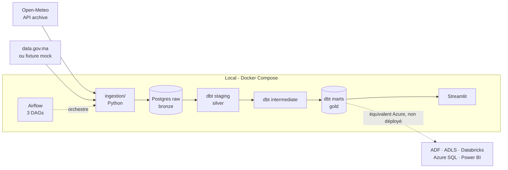
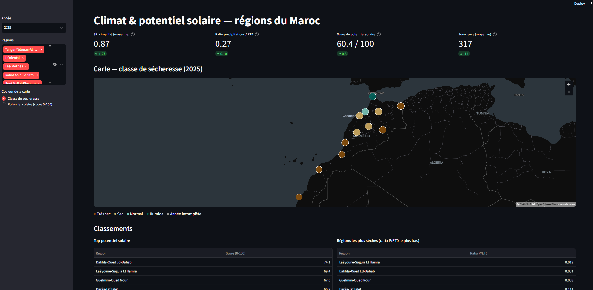
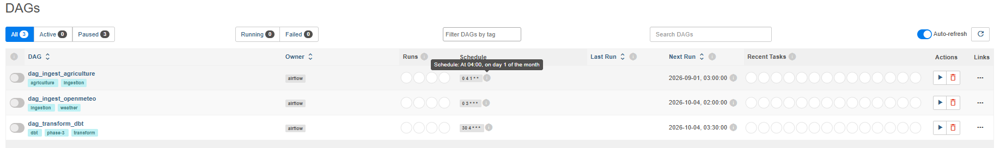
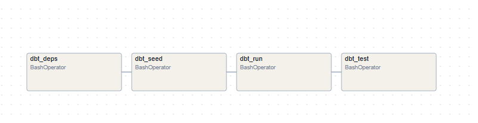
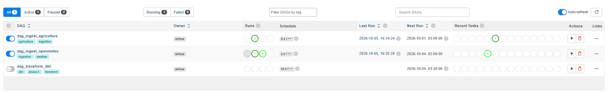
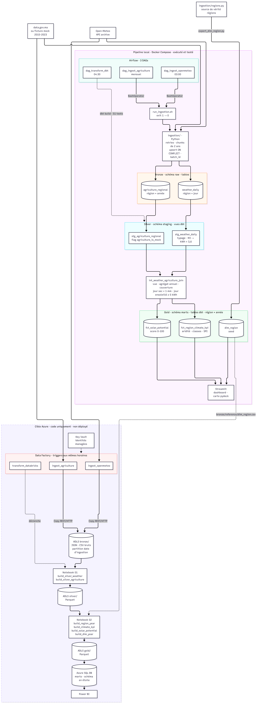

# Pipeline Data Climat & Agriculture

> **Recruteur pressé ?** → [Résumé du projet en 2 minutes](docs/recruiter_notes.md)

[](https://github.com/BadreMs/pipeline-data-climat-agriculture/actions/workflows/ci.yml)

[](LICENSE)


Pipeline de données de bout en bout (ingestion, orchestration, transformation dbt, dashboard) qui
croise la météo [Open-Meteo](https://open-meteo.com/) et des données agricoles pour produire, pour
les 12 régions du Maroc, des indicateurs de **sécheresse** et de **potentiel solaire** de 2015 à
aujourd'hui. Les données agricoles sont **synthétiques** (voir [Limites connues](#limites-connues)).
Une extension Azure (Data Factory, ADLS Gen2, Databricks, Azure SQL) est fournie en code et en
documentation, sans déploiement.

## Architecture



Architecture **medallion** : bronze (`raw`) → silver (`staging`) → gold (`marts`). Détails, règles
métier et correspondance avec Azure : [docs/architecture.md](docs/architecture.md).

## Stack technique

| Couche | Outils |
|---|---|
| Langage, packaging | Python 3.11, [uv](https://docs.astral.sh/uv/) (lockfile gelé) |
| Ingestion | httpx + tenacity (retries, chunks de 2 ans), pandas, SQLAlchemy 1.4, psycopg2 |
| Orchestration | Apache Airflow 2.9.3 (Docker Compose, LocalExecutor) |
| Stockage | PostgreSQL 15 (schémas `raw` / `staging` / `intermediate` / `marts`) |
| Transformation | dbt-core 1.8 + dbt-postgres 1.8, dbt_utils 1.3 (51 tests) |
| Restitution | Streamlit, pydeck (carte), plotly (séries), export CSV |
| Qualité | pytest, ruff, mypy `--strict`, pre-commit, GitHub Actions |
| Cloud cible *(non déployé)* | Azure Data Factory, ADLS Gen2, Databricks (PySpark), Azure SQL DB, Power BI |

## Quickstart local

Prérequis : Docker (avec Compose), [uv](https://docs.astral.sh/uv/), Python 3.11+, `make`
(optionnel : équivalents dans le [runbook](docs/runbook.md#quickstart-local-5-minutes)).

```bash
cp .env.example .env     # valeurs par défaut adaptées à un essai local
uv sync                  # dépendances verrouillées
make up                  # Postgres + Airflow (premier build : quelques minutes)
make ingest              # backfill 2015 -> aujourd'hui, 12 régions
make dbt-deps && make dbt-seed && make dbt-run && make dbt-test
make streamlit           # dashboard sur http://localhost:8501
```

Airflow : http://localhost:8080 (identifiants dans `.env.example`). Dépannage (Windows, ports,
contraintes Airflow...) : [docs/runbook.md](docs/runbook.md#dépannage).

> Le dossier racine du dépôt contient des espaces et un `&`. Le nom technique utilisé partout
> ailleurs (pyproject, Docker Compose, imports) est `pipeline-data-climat-agriculture`.

## Structure du projet

```
pipeline-data-climat-agriculture/
├── airflow/              # image Airflow, 3 DAGs, wrapper d'ingestion
├── ingestion/            # clients Open-Meteo / data.gov.ma, upserts idempotents
├── sql/init/             # DDL Postgres : bases, schémas, tables raw
├── dbt_project/          # models/{staging,intermediate,marts}, seeds/dim_region, macros
├── scripts/              # export_dim_region.py : seed généré depuis ingestion/regions.py
├── dashboard/            # logique testable du dashboard (fonctions pures, requêtes)
├── streamlit/            # app.py : interface Streamlit
├── azure/                # medallion Azure : Data Factory, Databricks, SQL, scripts (non déployé)
├── tests/                # pytest (ingestion, seed, dashboard, artefacts Azure)
├── docs/                 # architecture.md, runbook.md
├── .github/workflows/    # CI : ruff, mypy strict, pytest
└── Makefile · docker-compose.yml · pyproject.toml · uv.lock
```

## Résultats : indicateurs produits

12 régions × 11 années complètes (2015-2025) = **132 région-années** ; l'année 2026 est partielle
(données jusqu'au 15 septembre 2026) et ne reçoit ni classe, ni SPI, ni score. Chiffres issus des
marts `fct_region_climate_kpi` et `fct_solar_potential`, calculés le 5 octobre 2026 :

| Indicateur | Résultat |
|---|---|
| **Potentiel solaire** (moyenne 2015-2025) | de **5,11 kWh/m²/jour** (Tanger-Tétouan-Al Hoceïma, score 52,3) à **6,02** (Dakhla-Oued Ed-Dahab, score 75,2) |
| **Gradient d'aridité** (précipitations / ET0) | de **0,50** (Tanger-Tétouan-Al Hoceïma, ~650 mm/an) à **0,02** (Laâyoune-Saguia El Hamra, ~39 mm/an) : un facteur ~24 du nord au sud |
| **Classes de sécheresse** (132 région-années) | 60,6 % `tres_sec`, 32,6 % `sec`, 4,5 % `normal`, 2,3 % `humide` |
| **Années extrêmes** (SPI simplifié moyen) | 2017 la plus sèche (-0,74), 2018 la plus humide (+1,64) |

Le tableau de bord ([`streamlit/app.py`](streamlit/app.py)) expose ces indicateurs avec filtres
(année, régions), carte, classements, séries annuelles et export CSV.

## Pipeline Azure

Extension *medallion* sur Azure : Data Factory (ingestion), ADLS Gen2 (bronze / silver / gold),
Databricks PySpark (transformations), Azure SQL DB en étoile (serving Power BI), scripts de
déploiement en **simulation par défaut**. **Rien n'a été déployé ni exécuté** : le code est
vérifié statiquement (JSON, références, DDL, seuils comparés au SQL dbt, mypy/ruff) mais pas sur
Azure. Architecture, coûts estimés (ordre de grandeur) et procédure : [azure/README.md](azure/README.md).

## Limites connues

- **Agriculture synthétique** : aucune URL data.gov.ma stable ne fournit une série région × année ;
  une fixture mock est utilisée, signalée par `agriculture_is_mock` jusque dans le dashboard.
- **Backfill long** : des chunks d'ingestion peuvent être perdus sans signal dans Airflow
  (constaté et réparé) ; pas encore de test de complétude dbt.
- **dbt 1.8** (lignée dépréciée), imposé par les contraintes d'Airflow 2.9.3.
- **Indicateurs simplifiés** : SPI = z-score (pas de loi gamma), un point de mesure par région.
- **Azure non testé**, et logique métier dupliquée en PySpark par choix de démonstration.

Liste complète : [docs/architecture.md](docs/architecture.md#known-limitations).

## Roadmap

- [x] Phase 0 — Setup (repo, Docker Compose, tooling qualité)
- [x] Phase 1 — Ingestion locale (Open-Meteo, data.gov.ma)
- [x] Phase 2 — Orchestration Airflow
- [x] Phase 3 — Transformations dbt (staging, intermediate, marts, 51 tests)
- [x] Phase 4 — Restitution Streamlit
- [x] Phase 5 — Extension Azure (code + docs, non déployée)
- [x] Phase 6 — Documentation et CI

Suite envisagée : test de complétude dbt et récapitulatif des chunks en échec, vraie source
agricole, venv dbt dédié ou `dbt-databricks`, premier déploiement Azure réel.


## Aperçu

### Dashboard interactif


*Dashboard Streamlit — carte des 12 régions du Maroc, KPIs de sécheresse et de potentiel solaire, export CSV.*

### Orchestration Airflow


*3 DAGs : ingestion météo Open-Meteo (quotidien), ingestion agriculture (mensuel), transformations dbt (quotidien).*


*Chaîne de transformations dbt : `dbt_deps → dbt_seed → dbt_run → dbt_test`.*


*Exécution réussie du pipeline complet.*

### Architecture


*Architecture medallion — local (Postgres + dbt + Streamlit) et cible Azure (Data Factory + ADLS Gen2 + Databricks + Azure SQL).*

## Licence et auteur

[MIT](LICENSE) © 2026 Badre Moussaili.