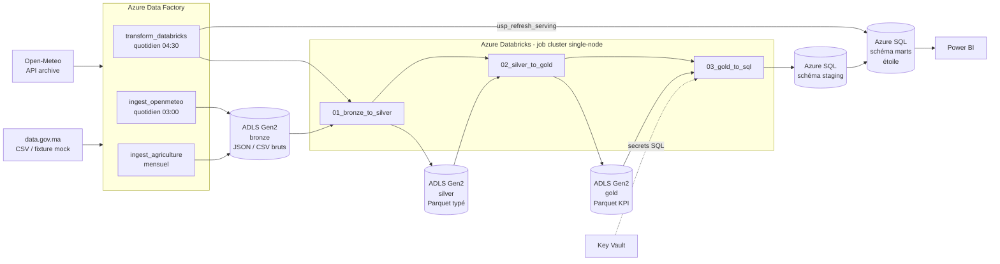

# Pipeline Azure — architecture medallion

> **Statut : code et documentation uniquement.** Rien n'a été déployé sur Azure, aucun
> abonnement n'a été utilisé, et **aucun de ces artefacts n'a été exécuté** : les notebooks
> PySpark n'ont jamais tourné sur un cluster (pyspark n'est même pas installé dans le projet),
> les pipelines ADF n'ont jamais été importés dans une Data Factory, le DDL T-SQL n'a jamais
> été joué sur Azure SQL. Seuls sont vérifiés automatiquement : la validité des JSON, la
> cohérence des références entre ressources ADF, la correspondance des régions avec
> `ingestion/regions.py`, l'identité des seuils métier avec le SQL dbt, la syntaxe des scripts
> shell et la conformité mypy/ruff des notebooks (`tests/test_azure_artifacts.py`).
> Le premier déploiement réel demandera du débogage.

Cette extension reproduit sur Azure le pipeline local (Airflow + Postgres + dbt) avec les
services managés équivalents. Le pipeline local reste la référence fonctionnelle.

## Architecture



## Correspondance local ↔ Azure

| Rôle | Local | Azure |
|---|---|---|
| Orchestration | Airflow (`dag_ingest_openmeteo`, `dag_ingest_agriculture`, `dag_transform_dbt`) | Data Factory (`ingest_openmeteo`, `ingest_agriculture`, `transform_databricks`) + 3 triggers |
| Bronze (brut) | Postgres `raw.weather_daily`, `raw.agriculture_regional` | ADLS Gen2 conteneur `bronze` (JSON Open-Meteo, CSV agriculture) |
| Silver (typé, nettoyé) | dbt `staging` : `stg_weather_daily`, `stg_agriculture_regional` | ADLS `silver` (Parquet) via `01_bronze_to_silver.py` |
| Intermédiaire | dbt `intermediate` : `int_weather_agriculture_join` | calculé dans `02_silver_to_gold.py` (pas de couche persistée) |
| Gold (KPI) | dbt `marts` : `fct_region_climate_kpi`, `fct_solar_potential`, seed `dim_region` | ADLS `gold` (Parquet) via `02_silver_to_gold.py` |
| Serving | Streamlit lit `marts` dans Postgres | Azure SQL DB (schéma `marts`, étoile) lu par Power BI |
| Qualité | tests dbt (51) + pytest | contrôles SQL (clés, `CHECK`), garde-fous Spark, tests de cohérence |
| Secrets | `.env` | Key Vault + identités managées |

Tableau détaillé modèle dbt ↔ notebook : [docs/architecture.md](../docs/architecture.md).

## Organisation du data lake

```
bronze/
  openmeteo/ingest_date=YYYY-MM-DD/region_code=MA-04/data.json   # réponse API brute, 1 fichier/région/jour
  agriculture/ingest_date=YYYY-MM-DD/source=<mock-not-configured|datagovma>/agriculture_regional.csv
  seed/agriculture_maroc_mock.csv                                 # fixture, copiée si aucune URL fournie
  reference/dim_region.csv                                        # 12 régions (seed dbt)
silver/
  weather_daily/year=YYYY/*.parquet
  agriculture_regional/*.parquet
gold/
  dim_region/  dim_year/  fct_region_climate_kpi/  fct_solar_potential/
```

Le partitionnement `ingest_date` conserve l'historique des ingestions (traçabilité, rejeu) ; le
silver garde la dernière ingestion gagnante par clé (`region_code`, `date`), comme l'upsert
idempotent du pipeline local.

## Coûts estimés (ordre de grandeur)

**≈ 10 à 30 € par mois** en usage de démonstration (1 exécution quotidienne), région
`francecentral`. Ce sont des **ordres de grandeur non vérifiés avec le calculateur de prix
Azure** : les tarifs varient selon la région, la date et l'offre. À recalculer avant tout
déploiement.

| Service | Hypothèse | Ordre de grandeur |
|---|---|---|
| ADLS Gen2 (LRS) | < 1 Go (bronze JSON, silver/gold Parquet) | ~ 1 € |
| Data Factory | ~ 20 activités par jour | ~ 1-2 € |
| Databricks | job cluster `Standard_DS3_v2` single-node, ~15 min/jour, plan Premium | ~ 3-8 € |
| Azure SQL DB | serverless 0,5-1 vCore, mise en pause après 60 min, ~5 Go | ~ 5-12 € |
| Key Vault | quelques secrets, peu d'opérations | < 1 € |

Leviers : cluster éphémère (créé par ADF, détruit après le run), SQL serverless avec pause
automatique, `teardown.sh` quand la démo est terminée. Piège : un rafraîchissement Power BI
réveille la base SQL.

## Prérequis

- Un abonnement Azure et les droits **Owner**, ou **Contributor** + **User Access
  Administrator** (le script crée des attributions de rôle).
- Azure CLI avec les extensions `datafactory` et `databricks`, plus `jq`, `envsubst`
  (gettext), `sqlcmd` et la CLI Databricks.
- Le déploiement n'utilise **pas de Service Principal** : Data Factory s'authentifie par
  identité managée (ADLS, Databricks, Azure SQL). Un Service Principal (ou mieux, une identité
  fédérée OIDC) ne serait utile que pour automatiser le déploiement depuis GitHub Actions.
- Un nom unique global (`UNIQUE_SUFFIX`) pour le compte de stockage, le serveur SQL et le
  Key Vault.

## Procédure de déploiement (haut niveau, non exécutée)

1. `az login`, puis `export SUBSCRIPTION_ID=... UNIQUE_SUFFIX=...`.
2. `./scripts/deploy.sh` : **simulation** par défaut, vérifier la sortie. Puis
   `SQL_ADMIN_PASSWORD=... ./scripts/deploy.sh --apply`.
3. Étapes manuelles que `az` ne couvre pas (rappelées en fin de script) : import des notebooks
   dans Databricks, secret scope adossé à Key Vault, external locations Unity Catalog,
   exécution des scripts SQL et création de l'utilisateur Data Factory dans la base.
4. Backfill initial : déclencher `ingest_openmeteo` avec `startDate=2015-01-01`, puis
   `transform_databricks`.
5. Démarrer les triggers (`--start-triggers`) une fois le premier run validé.
6. Fin de démo : `./scripts/teardown.sh --apply`.

## Choix de conception défendables, et leurs limites

- **ADF pour l'ingestion, Databricks pour la transformation** : séparation nette des rôles ;
  ADF gère déclencheurs, retries et connecteurs, Spark gère les transformations.
- **Bronze brut et partitionné par date d'ingestion** : rejouabilité et audit. Coût : le
  silver recalcule tout le bronze à chaque run (acceptable à ce volume, ~50 000 lignes ; à
  remplacer par un traitement incrémental avec Delta Lake au-delà).
- **Parquet plutôt que Delta** : choix de simplicité pour cette démonstration. En production,
  Delta Lake apporterait MERGE, transactions et time travel.
- **Chargement SQL en deux temps** (`staging` puis procédure de swap transactionnelle) : le
  serving n'est jamais vide pendant un chargement, et un gold vide n'écrase rien.
- **Duplication de la logique dbt en PySpark** : voir
  [databricks/notebooks/README.md](databricks/notebooks/README.md#pourquoi-la-duplication-).
- **Données agricoles** : même limite qu'en local. Aucune URL data.gov.ma stable ne fournit une
  série région × année ; la fixture synthétique est utilisée tant qu'aucune source n'est fournie
  (`agriculture_is_mock` traverse tout le pipeline jusqu'à Power BI).
- **Rapprochement des régions** dans l'agriculture : par libellé officiel uniquement. Les alias
  historiques gérés par le loader local (`REGION_ALIASES`) ne sont pas portés dans Spark.

## Contenu du dossier

| Chemin | Rôle |
|---|---|
| [data_factory/](data_factory/pipelines/README.md) | Linked services, datasets, pipelines et triggers ADF (JSON au format Git d'ADF) |
| [databricks/notebooks/](databricks/notebooks/README.md) | Notebooks PySpark bronze → silver → gold → SQL |
| [sql/](sql/README.md) | DDL Azure SQL, procédure de swap, vue Power BI |
| [scripts/](scripts/README.md) | `deploy.sh` et `teardown.sh` (simulation par défaut) |
