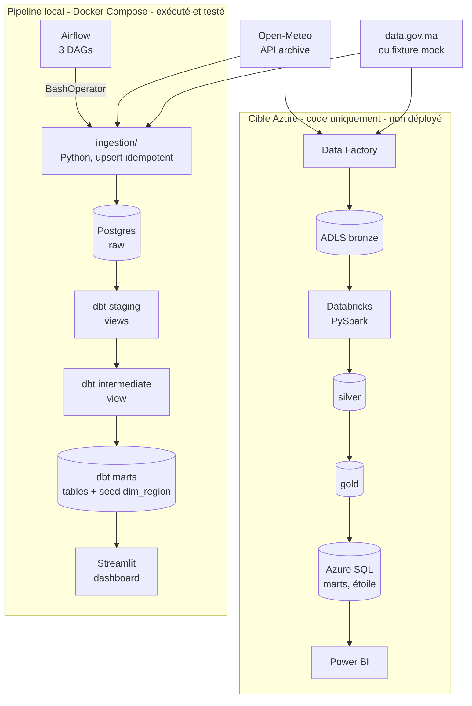

# Architecture

Pipeline de données de bout en bout qui croise la météo (Open-Meteo) et des données agricoles
pour produire, par région du Maroc et par année, des indicateurs de **sécheresse** et de
**potentiel solaire**. Le pipeline **local** est la référence fonctionnelle (exécuté et
testé) ; l'extension **Azure** est du code et de la documentation, jamais déployée.

Pour l'exploitation au quotidien (démarrage, commandes, dépannage) : [runbook.md](runbook.md).

## Vue d'ensemble

## Couches du pipeline local

| Couche | Schéma Postgres | Contenu | Matérialisation |
|---|---|---|---|
| Bronze | `raw` | `weather_daily` (région × jour), `agriculture_regional` (région × année), écrites par `ingestion/` avec traçabilité (`_source`, `_source_url`, `_batch_id`, `_ingested_at`) | tables (DDL dans `sql/init/`) |
| Silver | `staging` | `stg_weather_daily`, `stg_agriculture_regional` : typage, unités explicites, flags de complétude, conversion MJ → kWh | vues dbt |
| Intermédiaire | `intermediate` | `int_weather_agriculture_join` : agrégation annuelle par région, couverture, jointure agriculture | vue dbt |
| Gold | `marts` | `dim_region` (seed), `fct_region_climate_kpi`, `fct_solar_potential` : 1 ligne = 1 région × 1 année | tables dbt |

Les schémas sont forcés par la macro `generate_schema_name` (le `+schema` d'un modèle est
utilisé tel quel, sans préfixe `<target>_`). `dbt_project/profiles.yml` ne contient aucun secret :
tout passe par `env_var()`.

## Règles métier communes

Ces règles existent en SQL (dbt) et en PySpark (Azure). Le tableau est la référence unique ;
`tests/test_azure_artifacts.py` vérifie que les notebooks utilisent les mêmes valeurs que dbt.

| Règle | Valeur | Où |
|---|---|---|
| Conversion rayonnement | kWh/m² = MJ/m² ÷ 3,6 | `stg_weather_daily` |
| Jour sec | précipitations < 1 mm | `int_weather_agriculture_join` |
| Jour ensoleillé | ≥ 5 kWh/m²/jour | `int_weather_agriculture_join` |
| Année complète | couverture ≥ 95 % des jours | marts |
| Indice d'aridité | précipitations ÷ ET0 annuelles | `fct_region_climate_kpi` |
| Classes de sécheresse | < 0,20 `tres_sec` · < 0,50 `sec` · < 0,65 `normal` · ≥ 0,65 `humide` (inspirées de l'indice UNEP) | `fct_region_climate_kpi` |
| SPI simplifié | z-score des précipitations annuelles de la région, sur ≥ 5 années complètes | `fct_region_climate_kpi` |
| Score solaire (0-100) | 0,7 × score de rayonnement + 0,3 × part de jours ensoleillés ; rayonnement borné linéairement de 3,0 (0) à 7,0 kWh/m²/j (100) | `fct_solar_potential` |

Classes, SPI et scores ne sont calculés que pour les **années complètes** : une année partielle
est biaisée par la saisonnalité des pluies.

## Correspondance local ↔ Azure

| Rôle | Local | Azure |
|---|---|---|
| Orchestration | Airflow : `dag_ingest_openmeteo` (03:00), `dag_ingest_agriculture` (mensuel), `dag_transform_dbt` (04:30) | Data Factory : `ingest_openmeteo`, `ingest_agriculture`, `transform_databricks` + 3 triggers aux mêmes horaires |
| Ingestion | `ingestion/` (Python, retries, chunks de 2 ans) | Pipelines ADF : `Copy` REST/HTTP → ADLS (retries) |
| Bronze | Postgres `raw.*` | ADLS Gen2 `bronze/` (JSON, CSV bruts, partitionnés par date d'ingestion) |
| Silver | dbt `staging` | ADLS `silver/` (Parquet) |
| Gold | dbt `intermediate` + `marts` | ADLS `gold/` (Parquet) |
| Serving | Streamlit lit `marts` dans Postgres | Azure SQL DB `marts` (étoile), lu par Power BI |
| Secrets | `.env` | Key Vault, identités managées |
| Qualité | 51 tests dbt, pytest, mypy strict, ruff, CI | contraintes et `CHECK` SQL, garde-fous Spark, tests de cohérence |

### Modèle dbt ↔ notebook PySpark

| Modèle dbt | Notebook / fonction | Sortie Azure |
|---|---|---|
| seed `dim_region` | `bronze/reference/dim_region.csv` lu par 02 | `gold/dim_region` (copie du seed) |
| `stg_weather_daily` | 01 · `build_silver_weather` | `silver/weather_daily` |
| `stg_agriculture_regional` | 01 · `build_silver_agriculture` | `silver/agriculture_regional` |
| `int_weather_agriculture_join` | 02 · `build_region_year` | non persisté |
| `fct_region_climate_kpi` | 02 · `build_climate_kpi` | `gold/fct_region_climate_kpi` |
| `fct_solar_potential` | 02 · `build_solar_potential` | `gold/fct_solar_potential` |
| — (Azure seulement) | 02 · `build_dim_year` | `gold/dim_year` |

Écarts assumés : en Azure, le rapprochement des libellés de région de l'agriculture se fait par
nom officiel normalisé (le loader local gère aussi des alias historiques) ; les faits du schéma
en étoile ne portent pas `region_name` ni les coordonnées (dans `dim_region`) ; le silver
recalcule tout le bronze à chaque exécution.

**Pourquoi cette duplication ?** En production, on utiliserait `dbt-databricks` : les mêmes
modèles dbt s'exécuteraient sur Databricks, avec un seul code et un seul jeu de tests. Ici, la
phase Azure est une démonstration : PySpark brut pour montrer la maîtrise de Spark. Le risque de
dérive est réduit (constantes nommées, test de cohérence des seuils) mais pas supprimé : le test
ne compare pas les **résultats** des deux implémentations. Détails :
[azure/databricks/notebooks/README.md](../azure/databricks/notebooks/README.md).

## Choix techniques

- **dbt-core 1.8 (et non 1.12)** : dbt-core ≥ 1.9 est incompatible avec les contraintes
  d'Airflow 2.9.3 que l'image Docker applique (`protobuf==4.25.3`, `python-dotenv==1.0.1`,
  `sqlparse==0.5.0`). Vérifié avec `uv pip compile --constraint constraints-3.11.txt` : seule la
  lignée 1.8 se résout. `dbt-postgres` est borné à 1.8.x pour rester sur la même version
  mineure que le core. Conséquences : dbt 1.8 n'est plus maintenu activement, et le lockfile
  bloque mypy en 1.x. Alternative documentée : un venv dédié à dbt dans l'image Airflow
  (recommandation d'Airflow), plus lourd à mettre en place.
- **Seed `dim_region` généré depuis `ingestion/regions.py`** (`scripts/export_dim_region.py`) :
  une seule source de vérité, avec un test qui échoue si le CSV et le code divergent.
- **Grain région × année** : imposé par les données agricoles, annuelles.
- **Tests hermétiques** : les tests de configuration isolent aussi les variables d'environnement
  du process, car le Makefile exporte `.env` (nécessaire à dbt via `env_var()`).
- **Upserts idempotents** (`ON CONFLICT DO UPDATE`) et `batch_id` par exécution : un backfill
  ou une réparation se rejoue sans doublon.
- **Wrapper `run_ingestion.sh`** : traduit l'exit code 1 (succès partiel) en 0 pour éviter des
  retries inutiles ; voir les limites ci-dessous pour son effet de bord.
- **Dashboard : lecture directe des marts, carte pydeck** : pydeck était déjà une dépendance
  (aucune dépendance ni GeoJSON ajouté) ; un marqueur coloré par région au point de mesure,
  faute de polygones. La logique testable est dans `dashboard/` (fonctions pures), l'interface
  dans `streamlit/app.py`.
- **Transparence sur les données synthétiques** : `agriculture_is_mock` traverse staging,
  marts, dashboard (avertissement visuel) et serving SQL.

## Known limitations

### Données

- **Agriculture synthétique** : aucune URL data.gov.ma stable ne fournit une série région ×
  année. La fixture mock (2015-2023, 12 régions) est le comportement par défaut, pas un repli
  exceptionnel. Aucun indicateur n'est dérivé de ces colonnes.
- **Un point de mesure par région** (coordonnées d'un chef-lieu ou d'une ville de référence), pas
  une moyenne spatiale : les indicateurs régionaux sont représentatifs de ce point. Particularité :
  pour MA-12 le chef-lieu est libellé « Oued-Eddahab » et les coordonnées sont celles de Dakhla.
- **SPI simplifié** : z-score, pas le SPI normalisé (ajustement gamma). La référence tient sur
  une dizaine d'années complètes (2015-2025) seulement.
- **Classes de sécheresse** : seuils d'aridité UNEP appliqués à des totaux annuels ; ils
  produisent beaucoup de `tres_sec` (le Maroc est majoritairement aride), ce qui limite la
  lecture comparative.

### Ingestion et qualité

- **Chunks perdus masqués lors d'un backfill long** : constaté lors du premier backfill
  (MA-11 : 2017-2018, MA-08 : 2021-2022, 730 jours chacune), réparé manuellement. Le wrapper
  `run_ingestion.sh` traduit l'exit code 1 de `ingestion.run` en 0, ce qui supprime tout signal
  dans Airflow. Amélioration prévue : un récapitulatif des `failed_chunks` dans un fichier (par
  ex. `/tmp/last_ingest_failures.json`) exposé via XCom ou un contrôle de complétude.
- **Pas de test de complétude dbt** : aucun des 51 tests ne détecte des jours manquants. Test à
  ajouter : `days_observed >= 350` dans `int_weather_agriculture_join` pour les années complètes.
- **DAG `dag_transform_dbt`** : exclu de mypy et ruff (hors dépendances Airflow locales) et sans
  test automatisé ; `dbt deps` y tourne à chaque exécution (accès réseau requis).

### Outillage

- **dbt 1.8** : lignée dépréciée (voir choix techniques).
- **Image Airflow** : `git` n'est pas installé, `dbt debug` affiche un avertissement cosmétique.
- **CI** : le workflow GitHub Actions (ruff, mypy strict, pytest) n'a pas encore été exécuté sur
  GitHub à la date d'écriture. Les tests dbt et le dashboard ne sont pas couverts par la CI
  (ils demandent Postgres).
- **Windows** : `make` n'est pas toujours disponible et `bash` peut pointer vers un relais WSL
  vide (voir le [runbook](runbook.md#dépannage)).

### Azure

- **Rien n'a été déployé ni exécuté** : notebooks, pipelines ADF, DDL T-SQL et scripts n'ont
  jamais tourné. Le premier déploiement demandera du débogage. Voir
  [azure/README.md](../azure/README.md) pour les hypothèses, notamment sur les coûts (ordre de
  grandeur non vérifié).
- Duplication de la logique métier en PySpark (voir ci-dessus), Parquet au lieu de Delta Lake,
  silver en recalcul complet.
